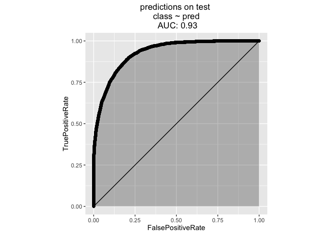
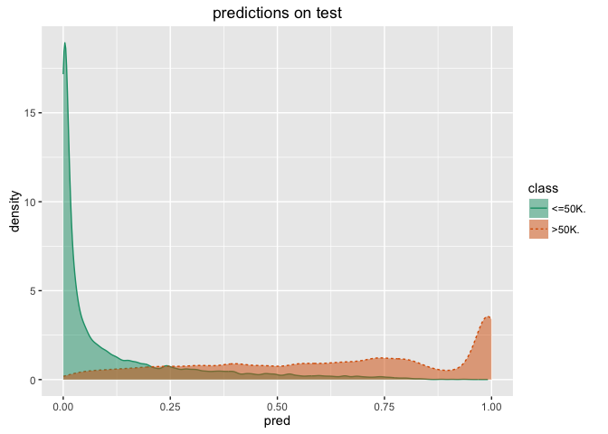

This article is a demonstration the use of the [R](https://cran.r-project.org) [vtreat](https://github.com/WinVector/vtreat) variable preparation package followed by [caret](http://topepo.github.io/caret/index.html) controlled training.

For discussion on this article please see [here](http://www.win-vector.com/blog/2016/06/a-demonstration-of-vtreat-data-preparation/). Note we have since swithced to `xgboost` in this demonstration inspired by this [nice article](http://blog.revolutionanalytics.com/2016/05/using-caret-to-compare-models.html).

In previous writings we have gone to great lengths to [document, explain and motivate `vtreat`](http://winvector.github.io/vtreathtml/). That necessarily gets long and unnecessarily feels complicated.

In this example we are going to show what building a predictive model using `vtreat` best practices looks like assuming you were somehow already in the habit of using vtreat for your data preparation step. We are deliberately not going to explain any steps, but just show the small number of steps we advise routinely using. This is a simple schematic, but not a guide. Of course we do not advise use without understanding (and we work hard to teach the concepts in our writing), but want what small effort is required to add `vtreat` to your predictive modeling practice.

First we set things up: load libraries, initialize parallel processing.

``` r
library('vtreat')
library('caret')
library('xgboost')
library('doMC')
library('WVPlots') # see https://github.com/WinVector/WVPlots

# parallel for vtreat
ncores <- parallel::detectCores()
parallelCluster <- parallel::makeCluster(ncores)
# parallel for caret
registerDoMC(cores=ncores)
```

The we load our data for analysis. We are going to build a model predicting an income level from other demographic features. The data is taken from [here](http://archive.ics.uci.edu/ml/machine-learning-databases/adult/) and you can perform all of the demonstrated steps if you download the contents of the [example git directory](https://github.com/WinVector/Examples/tree/master/CensusAdultIncomeExample). Obviously this has a lot of moving parts (R, R Markdown, Github, R packages, devtools)- but is very easy to do a second time (first time can be a bit of learning and preparation).

``` r
# load data
# data from: http://archive.ics.uci.edu/ml/machine-learning-databases/adult/
colnames <-
  c(
    'age',
    'workclass',
    'fnlwgt',
    'education',
    'education-num',
    'marital-status',
    'occupation',
    'relationship',
    'race',
    'sex',
    'capital-gain',
    'capital-loss',
    'hours-per-week',
    'native-country',
    'class'
  )
dTrain <- read.table(
  'adult.data',
  header = FALSE,
  sep = ',',
  strip.white = TRUE,
  stringsAsFactors = FALSE,
  na.strings = c('NA', '?', '')
)
colnames(dTrain) <- colnames
dTest <- read.table(
  'adult.test',
  skip = 1,
  header = FALSE,
  sep = ',',
  strip.white = TRUE,
  stringsAsFactors = FALSE,
  na.strings = c('NA', '?', '')
)
colnames(dTest) <- colnames
```

Now we use `vtreat` to prepare the data for analysis. The goal of vtreat is to ensure a ready-to-dance data frame in a statistically valid manner. We are respecting the test/train split and building our data preparation plan only on the training data (though we do apply it to the test data). This step helps with a huge number of potential problems through automated repairs:

-   re-encoding missing values
-   dealing with large cardinality categorical variables
-   dealing with novel levels
-   fixing variable/column names to be "R safe"
-   looking for strange column types

``` r
# define problem
yName <- 'class'
yTarget <- '>50K'
varNames <- setdiff(colnames,yName)

# build variable encoding plan and prepare simulated out of sample
# training fame (cross-frame) 
# http://www.win-vector.com/blog/2016/05/vtreat-cross-frames/
system.time({
  cd <- vtreat::mkCrossFrameCExperiment(dTrain,varNames,yName,yTarget,
                                        parallelCluster=parallelCluster)
  scoreFrame <- cd$treatments$scoreFrame
  dTrainTreated <- cd$crossFrame
  # pick our variables
  newVars <- scoreFrame$varName[scoreFrame$sig<1/nrow(scoreFrame)]
  dTestTreated <- vtreat::prepare(cd$treatments,dTest,
                                  pruneSig=NULL,varRestriction=newVars)
})
```

    ##    user  system elapsed 
    ##  12.308   3.900  37.671

``` r
#print(newVars)
```

Now we train our model. In this case we are using the caret package to tune parameters.

``` r
# train our model using caret
system.time({
  # work around "levels must be valid R variable names issue"
  dTrainTreated$yLogical = as.factor(paste0('v',as.character(dTrainTreated[[yName]]==yTarget)))
  # from:http://blog.revolutionanalytics.com/2016/05/using-caret-to-compare-models.html
  # could use accuracy as the tuning metric, but going to demonstrate using AUC
  ctrl <- trainControl(method = "cv",
                     number = 5,
                     summaryFunction=twoClassSummary,   # Use AUC to pick the best model
                     classProbs=TRUE,
                     allowParallel = TRUE)
  model <- train(x=dTrainTreated[,newVars],
                 y=dTrainTreated$yLogical,
                 method="xgbTree",
                 metric="ROC",
                 trControl=ctrl)
  print(model)
  dTest$pred <- predict(model,newdata=dTestTreated[,newVars],type='prob')[,'vTRUE']
})
```

    ## eXtreme Gradient Boosting 
    ## 
    ## 32561 samples
    ##    59 predictor
    ##     2 classes: 'vFALSE', 'vTRUE' 
    ## 
    ## No pre-processing
    ## Resampling: Cross-Validated (5 fold) 
    ## Summary of sample sizes: 26049, 26049, 26049, 26049, 26048 
    ## Resampling results across tuning parameters:
    ## 
    ##   eta  max_depth  colsample_bytree  nrounds  ROC        Sens     
    ##   0.3  1          0.6                50      0.9121452  0.9495146
    ##   0.3  1          0.6               100      0.9169122  0.9449029
    ##   0.3  1          0.6               150      0.9195356  0.9447816
    ##   0.3  1          0.8                50      0.9119917  0.9495550
    ##   0.3  1          0.8               100      0.9168835  0.9452670
    ##   0.3  1          0.8               150      0.9195048  0.9445388
    ##   0.3  2          0.6                50      0.9206587  0.9446602
    ##   0.3  2          0.6               100      0.9259485  0.9434061
    ##   0.3  2          0.6               150      0.9274337  0.9423948
    ##   0.3  2          0.8                50      0.9211680  0.9463592
    ##   0.3  2          0.8               100      0.9258033  0.9434061
    ##   0.3  2          0.8               150      0.9274843  0.9427994
    ##   0.3  3          0.6                50      0.9264924  0.9445388
    ##   0.3  3          0.6               100      0.9285126  0.9430016
    ##   0.3  3          0.6               150      0.9290218  0.9422330
    ##   0.3  3          0.8                50      0.9261755  0.9448220
    ##   0.3  3          0.8               100      0.9284512  0.9427994
    ##   0.3  3          0.8               150      0.9290237  0.9423139
    ##   0.4  1          0.6                50      0.9139934  0.9453479
    ##   0.4  1          0.6               100      0.9189610  0.9448220
    ##   0.4  1          0.6               150      0.9213668  0.9444175
    ##   0.4  1          0.8                50      0.9139227  0.9450243
    ##   0.4  1          0.8               100      0.9188494  0.9442961
    ##   0.4  1          0.8               150      0.9211883  0.9442152
    ##   0.4  2          0.6                50      0.9227377  0.9446197
    ##   0.4  2          0.6               100      0.9268441  0.9437298
    ##   0.4  2          0.6               150      0.9282453  0.9435275
    ##   0.4  2          0.8                50      0.9228568  0.9427589
    ##   0.4  2          0.8               100      0.9266806  0.9416667
    ##   0.4  2          0.8               150      0.9280849  0.9424757
    ##   0.4  3          0.6                50      0.9271894  0.9430016
    ##   0.4  3          0.6               100      0.9284112  0.9420307
    ##   0.4  3          0.6               150      0.9284006  0.9422735
    ##   0.4  3          0.8                50      0.9272078  0.9432848
    ##   0.4  3          0.8               100      0.9285555  0.9421117
    ##   0.4  3          0.8               150      0.9284007  0.9413835
    ##   Spec     
    ##   0.5694430
    ##   0.5986474
    ##   0.6096157
    ##   0.5702079
    ##   0.5976272
    ##   0.6096155
    ##   0.6213505
    ##   0.6380575
    ##   0.6477503
    ##   0.6179056
    ##   0.6402256
    ##   0.6462191
    ##   0.6346140
    ##   0.6483878
    ##   0.6529788
    ##   0.6347414
    ##   0.6510659
    ##   0.6573158
    ##   0.5895929
    ##   0.6093607
    ##   0.6180331
    ##   0.5912502
    ##   0.6103811
    ##   0.6202018
    ##   0.6258144
    ##   0.6436686
    ##   0.6476228
    ##   0.6324454
    ##   0.6439247
    ##   0.6473687
    ##   0.6425208
    ##   0.6515759
    ##   0.6556567
    ##   0.6474958
    ##   0.6574436
    ##   0.6594836
    ## 
    ## Tuning parameter 'gamma' was held constant at a value of 0
    ## 
    ## Tuning parameter 'min_child_weight' was held constant at a value of 1
    ## ROC was used to select the optimal model using  the largest value.
    ## The final values used for the model were nrounds = 150, max_depth = 3,
    ##  eta = 0.3, gamma = 0, colsample_bytree = 0.8 and min_child_weight = 1.

    ##    user  system elapsed 
    ## 173.892   4.938  81.294

Finally we take a look at the results on the held-out test data.

``` r
WVPlots::ROCPlot(dTest,'pred',yName,'predictions on test')
```



``` r
WVPlots::DoubleDensityPlot(dTest,'pred',yName,'predictions on test')
```



``` r
confusionMatrix <- table(truth=dTest[[yName]],pred=dTest$pred>=0.5)
print(confusionMatrix)
```

    ##         pred
    ## truth    FALSE  TRUE
    ##   <=50K. 11709   726
    ##   >50K.   1337  2509

``` r
testAccuarcy <- (confusionMatrix[1,1]+confusionMatrix[2,2])/sum(confusionMatrix)
testAccuarcy
```

    ## [1] 0.8732879

Notice the achieved test accuracy is in the ballpark of what was reported for this dataset.

    (From http://archive.ics.uci.edu/ml/machine-learning-databases/adult/adult.names )
    Error Accuracy reported as follows, after removal of unknowns from
     |    train/test sets):
     |    C4.5       : 84.46+-0.30
     |    Naive-Bayes: 83.88+-0.30
     |    NBTree     : 85.90+-0.28

We can also compare accuracy on the "complete cases":

``` r
dTestComplete <- dTest[complete.cases(dTest[,varNames]),]
confusionMatrixComplete <- table(truth=dTestComplete[[yName]],
                                 pred=dTestComplete$pred>=0.5)
print(confusionMatrixComplete)
```

    ##         pred
    ## truth    FALSE  TRUE
    ##   <=50K. 10650   710
    ##   >50K.   1268  2432

``` r
testAccuarcyComplete <- (confusionMatrixComplete[1,1]+confusionMatrixComplete[2,2])/
  sum(confusionMatrixComplete)
testAccuarcyComplete
```

    ## [1] 0.8686587

``` r
# clean up
parallel::stopCluster(parallelCluster)
```

These two scores are [within noise bounds of each other](http://www.win-vector.com/blog/2015/09/willyourmodelworkpart2/), but it is our experience that missingness is often actually informative, so in addition to imputing missing values you would like to preserve some notation indicating the missingness (which `vtreat` does in fact do).

And that is all there is to this example. I'd like to emphasize that vtreat steps were only a few lines in one of the blocks of code. `vtreat` treatment can take some time, but it is usually bearable. By design it is easy to add vtreat to your predictive analytics projects.

The point is: we got competitive results on real world data, in a single try (using vtreat to prepare data and caret to tune parameters). The job of the data scientist is to actually work longer on a problem and do better. But having a good start helps.

The theory behind vtreat is fairly important to the correctness of our implementation, and we would love for you to read through some of it:

-   [vtreat: designing a package for variable treatment](http://www.win-vector.com/blog/2014/08/vtreat-designing-a-package-for-variable-treatment/)
-   [vtreat Cross Frames](http://www.win-vector.com/blog/2016/05/vtreat-cross-frames/)
-   [On Nested Models](http://www.win-vector.com/blog/2016/04/on-nested-models/)
-   [vtreat manuals](http://winvector.github.io/vtreathtml/)
-   [Preparing data for analysis using R](http://winvector.github.io/DataPrep/EN-CNTNT-Whitepaper-Data-Prep-Using-R.pdf)
-   [More on preparing data](http://www.win-vector.com/blog/2016/03/more-on-preparing-data/)
-   [vtreat on Cran](https://cran.r-project.org/package=vtreat)
-   [vtreat on Github](https://github.com/WinVector/vtreat)

But operationally, please think of `vtreat` as just adding a couple of lines to your analysis scripts. Again, the raw R markdown source can be found [here](https://github.com/WinVector/Examples/blob/master/CensusAdultIncomeExample/ExampleRun.Rmd) and a rendered copy (with results and graphs) [here](https://github.com/WinVector/Examples/blob/master/CensusAdultIncomeExample/ExampleRun.md).
